## Big Data
The initial definition of Big Data revolves around the three V's:  
**Volume, Velocity, and Variety**  
**Volume**: the sample size is too large to store it in one machine. There are some techniques such as MapReduce, Hadoop, etc.  
**Velocity**: data is generated and collected very fast, so we need efficient computational algorithms to analyze the data on the fly.  
**Variety**: the data types might take different shapes, such as images, videos, etc.  

## High-Dimensional Data
High-Dimensional data can be defined as data set with a large number of attributes, such as images, videos, surveys, etc. Our main question is **_How we can extract useful information from these massive data sets?_**  
HD analytics challenge is mainly related to the **Curse of dimensionality**:
* **_Model learning issue_**: as distance between observations increases with the dimensions, the sample size required for learning a model drastically increases.
  * Solutions: feature extraction and dimension reduction through low-dimensional learning.  

## Functional Data Analysis
Functional data can be defined as a fluctuating quantity or impulse whose variations represent information and is often represented as a function of time or space.  

## Regression
Suppose we have a collection of _i.i.d_ training data  

$(x_1, y_1),...,(x_n, y_n)$  

Where x's are explanatory (independent) variables and y is the response (dependent) variable.  
* We want to build a function $f(x)$ to model the relationship between x's and y.  
* An intuitive way of finding $f(x)$ is by minimizing the following loss function  
$min_{f(x)}\sum_{i=1}^n(y_i-f(x_i))^2$  
This loss function represents the squared difference between the observed y and the outcome of the function, $f(x)$.  
* However, minimizing this optimization model is sometimes impossible if we don't know the structure of the function, so we have to impose some constraints/structure on $f(x)$, such as:  
$f(x) = \beta_0+\beta_1x_1+...+\beta_px_p$  

## Splines and Piecewise Regression

### Polynomial Regression  
Polynomial Regression extends the linear model by adding extra predictors, obtained by raising each of the original predictors to a power. It replaces the standard linear model  
$y_i = \beta_0+\beta_1x_i+\epsilon_i$  
with a polynomial function  
$y_i = \beta_0+\beta_1x_i+\beta_2x_i^2+\beta_3x_i^3+...+\beta_dx_i^d+\epsilon_i$
Notice that the coefficients can be easily estimated using least squares linear regression because this is just a standard linear model with predictors $x_i, x_i^2,x_i^3,...,x_i^d$.  

#### Polynomial vs Nonlinear Regression  
* Both types of regressions are used to model a nonlinear response between the response and predictors.
* **Polynomial regression, however, is considered a linear model**. On the other hand, nonlinear regression the function is a nonlinear combination of parameters. **Nonlinearity is not defined by the predictors but the parameters**.
* Nonlinear regression often requires domain knowledge or first principles for finding the underlying nonlinear function.

#### Disadvantages of Polynomial regression
* Remote part of the function is very sensitive to outliers  
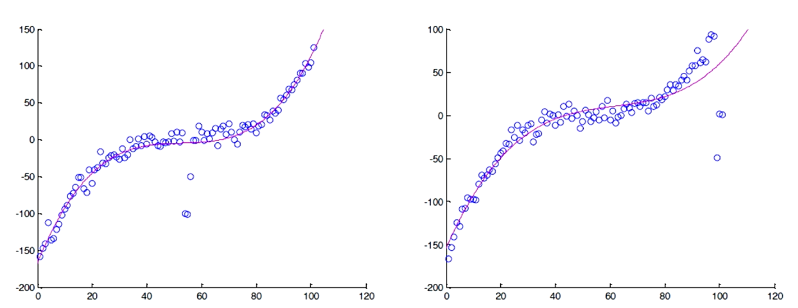  
* Limited flexibility due to its global functional structure. For example, if you use a cubic polynomial function you are assuming that the pattern of observed data follows a cubic form on the whole range of data.  
A solution to these problems could be to move from global regression to local regression. Divide the range of x's that we have into segments and in each segment fit a local polynomial function. This can be formalized with the idea of **splines**.  

### Splines  
Splines can be defined as a linear combination of Piecewise polynomial functions under continuity assumption. The idea is to partition the domain x into continuous intervals and on each interval fit a local polynomial function.   
* Suppose $x \in [a,b]$. Partition the x domain using the following points (a.k.a. **knots**).  
$a< \xi_1 < \xi_2 < ... < \xi_K < b $  
Where $\xi_0 = a$ and $\xi_{K+1} = b$  
* We then fit a polynomial in each interval under the continuity conditions and combine them by the linear combination:   
$f(X) = \sum_{m=1}^K\beta_mh_m(X)$  
Where $h_m(X)$ is the _mth_ transformation of X.   

#### Basis functions
Polynomial regression models are a special case of a **basis function** approach. The idea is to have a family of functions or transformations that can be applied to a variable X, so instead of fitting a linear model we fit the model  
$y_i = \beta_0 + \beta_1h_1(x_i) + \beta_2h_2(x_i) + ... + + \beta_Kh_K(x_i)$  

#### Piecewise Polynomials
A piecewise polynomial function $f(X)$ _is obtained by dividing the domain of $X$ into contiguous intervals, and representing f by a separate polynomial in each interval_.  

#### Splines - Examples
* **The piecewise constant spline** is a 0 _th_ degree polynomial defined as an indicator function,  
$h_1(X) = I(X<\xi_1), h_2(X) = I(\xi_1\leq X < \xi_2), h_3(X) = I(\xi_2\leq X)$  
We can define a local polynomial for each region, and then we can find the linear combination of those three functions to define a global function  
$f(X) = \sum_{m=1}^K\beta_mh_m(X)$  
In this case, the beta hat estimate will be equal to the average of points on each local region, as we can see on the image below:  
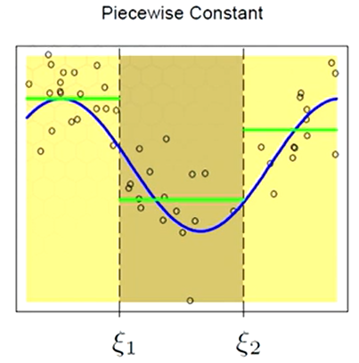  
* **Piecewise linear spline** would be intercept plus slope. So in addition to the other functions we had, we add another three:  
$h_{m+3}= h_m(X)X$, where $h_m(X)$ is still an indicator function.  
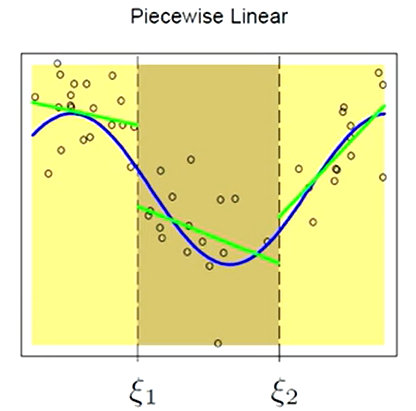  

As we can see from both figures, there are two issues with the estimated functions: **discontinuity and underfitting**.

#### Continuity
To make sure that the function is continuous, we can impose some continuity constraints on each knot. For the previous example (piecewise linear spline), we have the following:  
$f(x) = \sum_{m=1}^6\beta_mh_m(X)$  
Here, m goes from 1 to six because we have in total 6 basis functions (the first three are the indicator functions, and the other three are $h_m(X)X$.  
1. We have three regions. Our basis functions are:  
$h_1(X) = I(X<\xi_1)$, $h_2(X) = I(\xi_1\leq X<\xi_2)$, $h_3(X) = I(\xi_2\leq X)$  
2. The line that fits regions:  
$X<\xi_1$ is: $y_1 = \beta_1h_1(X)+\beta_4h_1(X)X$  
$\xi_1\leq X < \xi_2$ is: $y_2 = \beta_2h_2(X)+\beta_5h_2(X)X$
$\xi_2\leq X $ is: $y_3 = \beta_3h_3(X)+\beta_6h_3(X)X$             
3. We impose a continuity constraint for each knot:  
$f(\xi_1^-) = f(\xi_1^+)$, which gives us: $\beta_1 + \xi_1\beta_4 = \beta_2+\xi_1\beta_5$  
$f(\xi_2^-) = f(\xi_2^+)$, which gives us: $\beta_2+\xi_2\beta_5 = \beta_3+\xi_2\beta_6$

Alternatively, we could incorporate the constraints into the basis functions:  
$h_1(X) = 1$,$h_2(X) = X$, $h_3(X) = (X-\xi_1)_+$, $h_4(X) = (X-\xi_2)_+$  
This is known as a **truncated power basis**. The value of this function is:  
$h(x,\xi) = (x-\xi) = (x-\xi) $ if $x >\xi$ and 0 otherwise. This means that we basically truncate the negative side of the function, as we can see on the graph below.
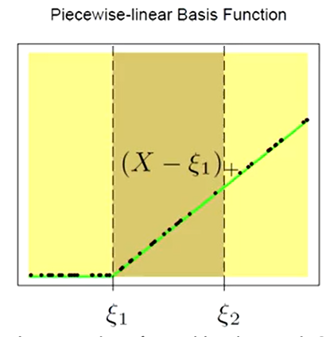  

The general function to define truncated power basis functions is:  
$h_j(X) = X^{j-1}$, $j = 1,...,M$
$h_{M+l}(X) = (X-\xi_l)_+^{j-1}$, $l = 1,...,K$  
_The total degrees of freedom is K+M_

#### Underfitting
To fix the underfitting problem, we can use higher order of the local polynomial. The figure below shows a series of piecewise cubic polynomials fit to the same data, with increasing orders of continuity at the knots. The function in the lower right panel is continuous and has continuous first and second derivatives at the knots.  
$f(\xi_j^-) = f(\xi_j^+)$  
$f'(\xi_j^-) = f'(\xi_j^+)$
$f''(\xi_j^-) = f''(\xi_j^+)$, $j = 1,...,K$  
$h_1(X) = 1$,$h_2(X) = X$, $h_3(X) = X^2$, $h_4(X) = X^3$, $h_5(X) = (X-\xi_1)^3_+$, $h_6(X) = (X-\xi_2)^3_+$

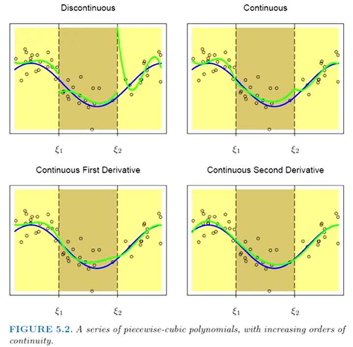

Here, the degrees of freedom of the spline can be calculated by **(# of regions)(# of parameters in each region) - (# of knots)(# of constraints per knot)**. For the example, we have (3 regions)(4 parameters) - (2 knots)(3 constraints per knot) = 6 degrees of freedom.  

#### Order-M Splines  
In general, we can define order-M splines, in which we use polynomials of order M-1.  

| Order-M      | Type of polynomial |
| -----------  | -----------        |
| M = 1        | piecewise-constant splines|
| M = 2        | linear splines               |
| M = 3        | quadratic splines              |
| M = 4        | cubic splines               |  

#### Estimation  
After creating the basis functions, we can use OLS to estimate the parameters $\beta$.
We define the matrix **H**, which has the basis functions on each of its columns and the number of rows equal to the number of observations:  
H = $\large[$ $h_1(X)$	$h_2(X)$ $h_3(X)$	$h_4(X)$ $h_5(X)$	$h_6(X)$ $\large]$  
* Using OLS we obtain the beta estimate equal to:  
$\hat{\beta} = \large(H^TH\large)^{-1}H^Ty$  
* **The linear Projection or Linear Smoother** is equal to:  
$\hat{y} = H\hat{\beta} = H\large(H^TH\large)^{-1}H^Ty = Sy$  
* The degrees of freedom (_df_) are equal to the _trace_ of _**S**_.  

#### Pros and cons of truncated power basis functions  
* Truncated power basis functions are simple and algebraically appealing
* On the other hand, they are not efficient for computation and numerically unstable

### B-Splines
#### Computational issues of Splines
As mentioned earlier, truncated power basis functions are simple and algebraically appealing. However, they are numerically unstable due to the high correlation of the basis vectors. For example, lets consider the truncated power basis of a cubic spline  
$h_1(X) = 1$,$h_2(X) = X$, $h_3(X) = X^2$, $h_4(X) = X^3$, $h_5(X) = (X-\xi_1)^3_+$, $h_6(X) = (X-\xi_2)^3_+$  
For a positive range of X, $X, X^2$, and $X^3$ are highly correlated. Therefore, **this makes the matrix $H^TH$ close to singular, which gives us a numerical instability in the matrix inversion and the determinant of $H^TH$ is close to 0.**.  
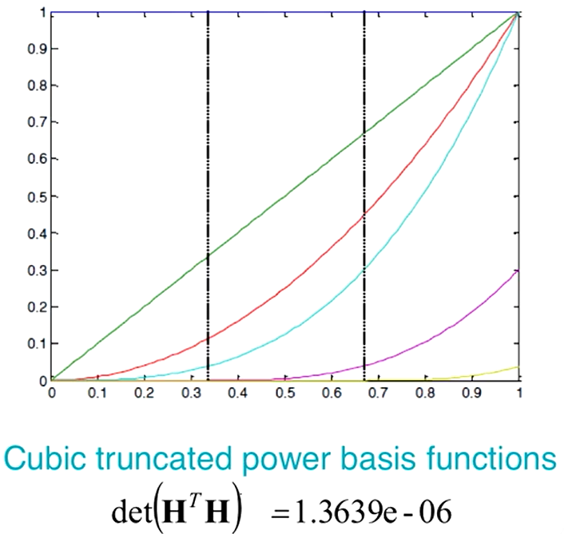  

One possible solution for this problem is to use _B-splines_.  

#### Steps to create B-splines basis vectors of order M with k knots
1. Create two M augmented knots sequences, $\tau$.  
M of them will be before the lower bound: $\tau_1 \leq \tau_2 \leq \tau_3 \leq ... \leq \tau_M \leq \xi_0$  
The original knots, $\xi_i$, could be written as: $\tau_{M+j} = \xi_j$, $j = 1,...,K$
M of them after the lower bound: $\xi_{K+1} \leq \tau_{M+K+1} \leq \tau_{M+K+2} \leq \tau_{M+K+3} \leq ... \leq \tau_{2M+K} $  
The actual values of these additional knots beyond the boundary are arbitrary, and it is customary to make them all the same and equal to the lower and upper bound, respectively.  
2. Let $B_{j,m}(x)$ be the $j^{th}$ B-spline basis function of order m ($m\leq M$) for the knot sequence $\tau$. They are defined recursively in terms of divided differences as follows:
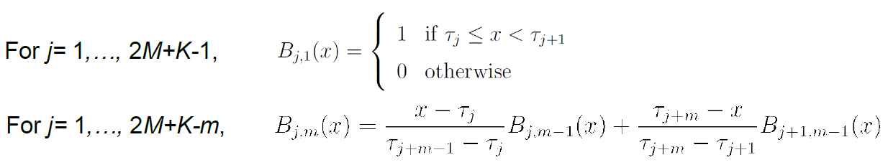  

### Smoothing Splines  
#### Boundary Effects on Splines  
Suppose we have functional data coming from the equation  
$y_i = f(x_i) + \epsilon_i$
Where the residuals are normal with mean 0 and variance sigma squared.  
The variance of the function can be estimated with the equation:  
$Var(\hat{f}(x)) = h(x)^T(H^TH)^{-1}h(x)\sigma^2$  
Here, **H** is the basis matrix and **h(x)^T** is the row corresponding to the row x in the **H** matrix.  
If we plot the pointwise variance from a cubic spline with two knots, as shown below, we observe that the variance near the boundaries for cubic splines is much larger than the variance of the global polynomial. The reason behind this is that **the complexity of the cubic spline is more than the complexity of global polynomials due to the large number of parameters that the cubic spline has**.   
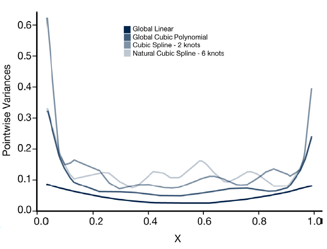  
A more complex model reduce the estimation bias but increase the estimation variance. In order to reduce the variance of the model, one thing we can do is reduce the complexity of the splines by using linear splines rather than cubic splines. We can achieve this by using **natural splines**.  

#### Natural Cubic Splines
With natural cubic splines **we use linear polynomials in the regions beyond the boundary knots, which are before the first knot and after the last knot. For other regions, we use regular cubic splines** as the ones used in normal cubic splines. This **reduces the prediction variance, but the price is that we get larger bias near the boundaries**.  
* The degrees of freedom is K, the number of knots.
* To form the basis matrix we can compute each basis function using the following set of equations:
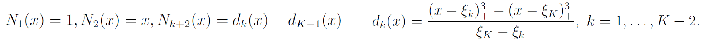  
  * The first and second columns of the basis matrix correspond to the linear term which is nonzero for the whole range of x. $N_1(x)$ is for the intercept and $N_2(x)$ is for the slope.  
  * The remaining columns are determined by the cubic truncated powers. Here, we choose 0 beyond $\xi_1$ and $\xi_K$ which are the first and last knots. The reason is because we want to have linear relationship or linear polynomials beyond these two regions. That's why we don't use truncated power basis for these regions.  
  * In R, the syntax to create the basis matrix is _B = ns(x,df,intercept)_  

#### Smoothing splines
* We know that one of the parameters that we want to determine in a spline regression is the number of knots. Here, **we discuss a method that avoids the knots selection problem by selecting the maximum number of knots, which is the same as the sample size we have.**  
* However, there is one problem: we know that the maximum number of knots increase the number of local polynomials, which in turn increase the overall complexity of the model and therefore the prediction variance increases.  
* One way to control the complexity of the estimated function is to use penalization. We can write a penalized least square in the form shown below:  
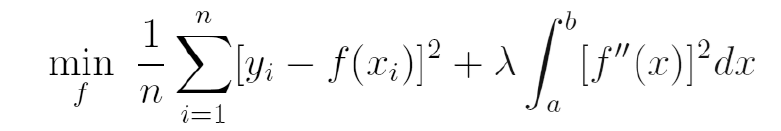  
Where $f(x_i)$ is the function we want to estimate and it is a function with two continuous derivatives, and $f''(x)$ is the second derivative of this function.  
  * In the minimization problem, the _first term_ **represent the estimation error**, which measures the closeness of the model to the data that we have, which is related to **bias**.
  * The _second term_ **penalizes the curvature of the function**. We know that the minimum valur of $[f''(x)]^2$ is 0, and that is attained when the function is linear. So this term what is trying to do is to push the model to a linear form, which encourages less complexity, which is related to **variance**.  
  * As we can see, we have a tradeoff between bias and variance.  
  * Lambda is an important factor, because it is a weight of the penalty term, also known as the **smoothing parameter**. It controls the tradeoff between bias and variance. If we **increase** lambda, we will get a **less complex model**, therefore smaller variance. On the other hand, if we **decrease** lambda, we will get **smaller variance, but higher bias**.
  * **Extreme cases of lambda**: if lambda is 0, we will be interpolating the data, overfitting it. If lambda is infinity, the second term enforces the model to be linear, and therefore it becomes the linear least squares model.
* It can be shown that the function that minimizes the optimization problem is a linear combination of natural cubic splines. This means that $\hat{f}(x)$ can be estimated by the summation of $\theta_j$ by the basis vector $N_j(x)$.  
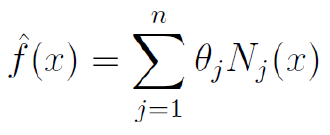  
* Substituting the formula shown above for $f(x_i)$, we get the following optimization problem in matrix form:  
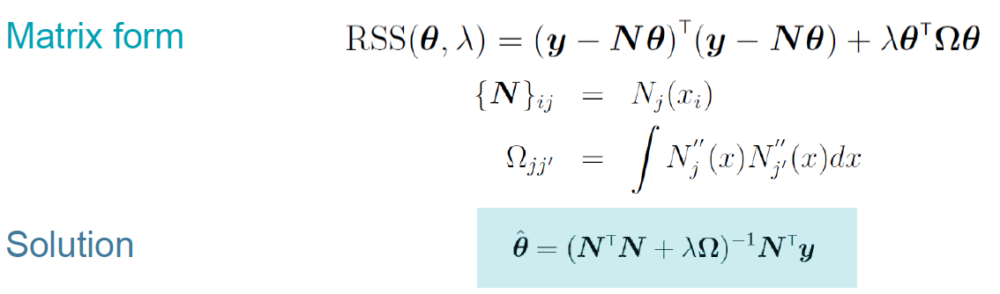  

#### Smoother matrix
Similar to b-spline, the smoother spline estimator is a linear smoother.  
$\hat{f} = N(N^TN+\lambda\Omega)^{-1}N^Ty$  
$=S_{\lambda}y$  

* $S_{\lambda}$ is the smoother matrix  
* $S_{\lambda}$ is NOT idempotent  
* $S_{\lambda}$ is symmetric  
* $S_{\lambda}$ is positive definite  
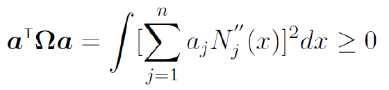
* The degrees of freedom are equal to the trace of $S_{\lambda}$  

#### Choice of Tuning Parameter
The choice of a tuning parameter is very important. It can be chosen by an independent validation data set.
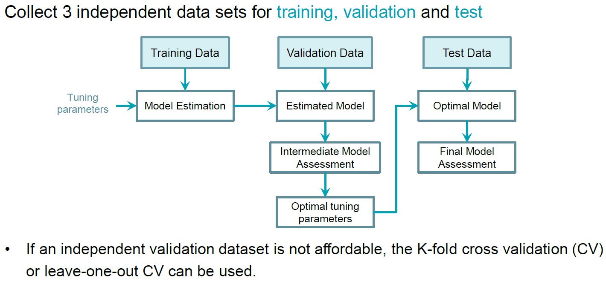  

##### K-fold cross validation (CV)  
  

##### Model selection criteria
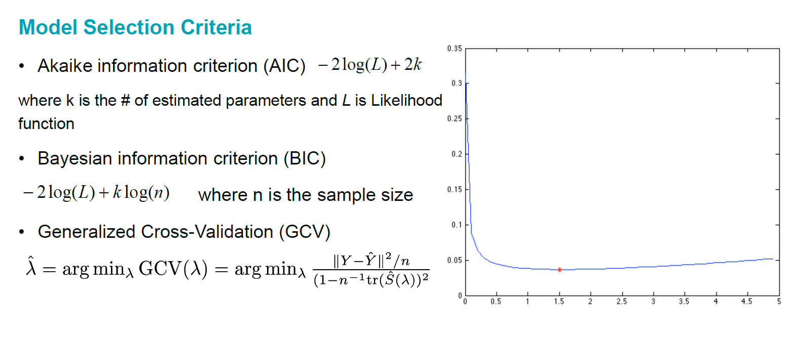
